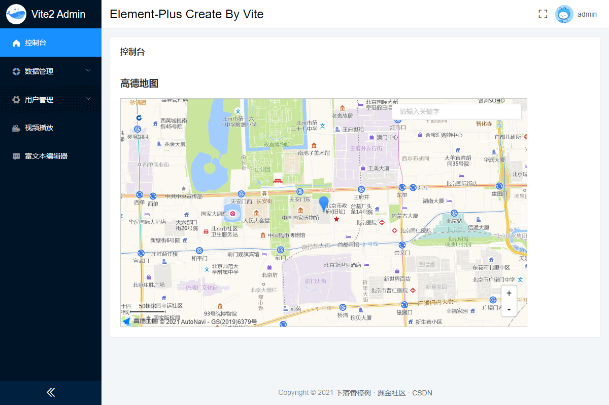
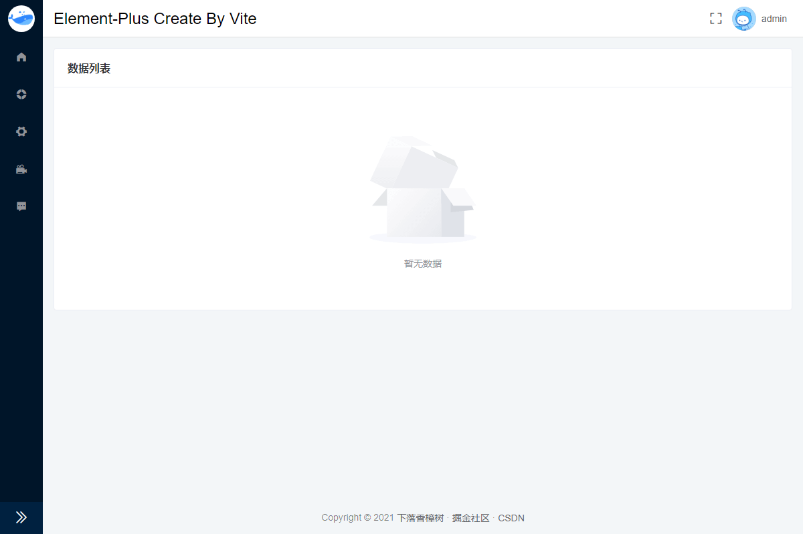
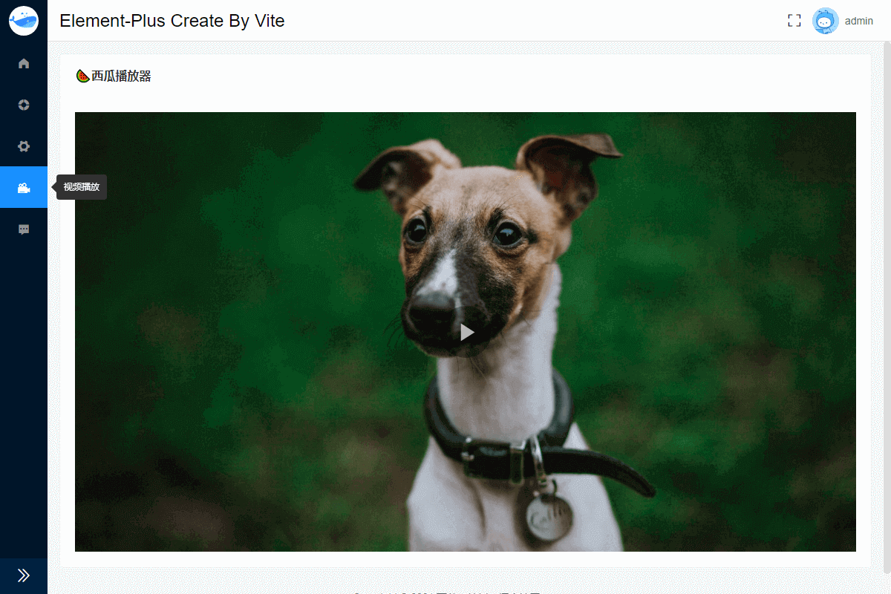
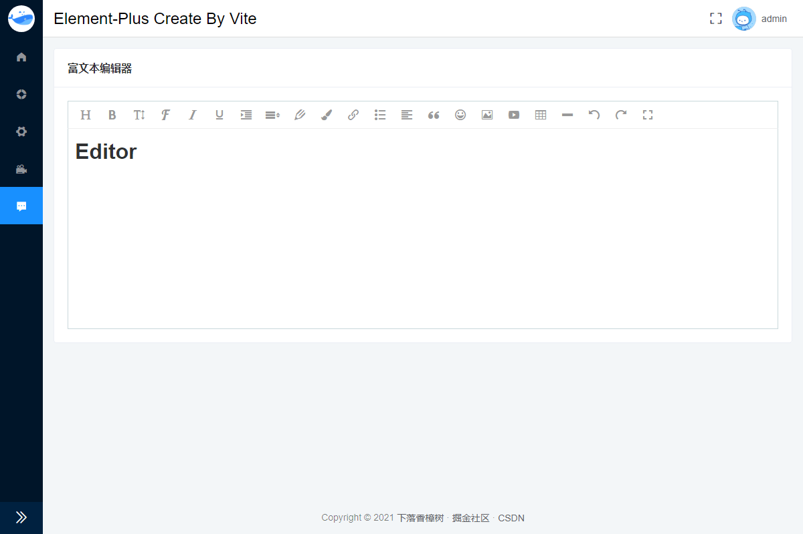
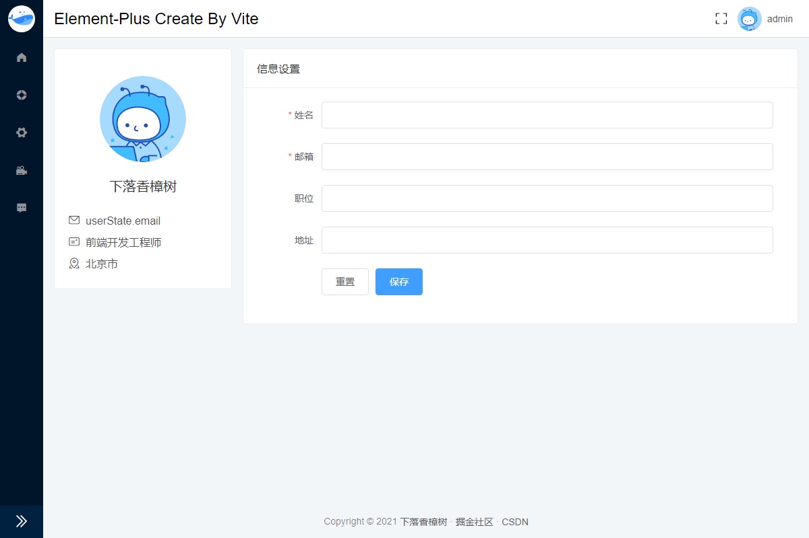

# VUE3 后台管理系统「模板构建」

## 🍎 系统简介

- 此管理系统是基于 **Vite2** 和 **Vue3** 构建生成的后台管理系统。目的在于学习 _vite_ 和 _vue3_ 等新技术，以便于后续用于实际开发工作中；
- 本文章将从管理系统页面布局、_vue_ 路由鉴权、_vuex_ 状态管理、数据持久化、用户信息加密等方面进行介绍和记录；
- 这也是我边学习边实践的过程，此次记录一是方便自己日后开发过程中有用到时候便于借鉴和复习，再次是为了初学 _vue3_ 和尝试上手 _vite2_ 和 _vue3_ 搭建管理系统的小伙伴提供一些学习方法和技术点；
- 本 Vue 后台管理系统使用的技术点主要有：[vite2](https://cn.vitejs.dev/)、[vue3](https://v3.cn.vuejs.org/)、[vue-router4.x](https://next.router.vuejs.org/zh/)、[vuex4.x](https://next.vuex.vuejs.org/zh/index.html)、vuex-persistedstate（vuex 数据持久化）、[Element Plus](https://element-plus.gitee.io/#/zh-CN)等。

## 🚗 用户登录


#### 登录页面代码

```html title="登录页 html"
<template>
	<div class="login">
		<el-card class="login_center">
			<template #header>
				<div class="card_header">
					<span>用户登录</span>
				</div>
			</template>
			<el-form :model="loginFormState" :rules="rules" ref="loginFormRef">
				<el-form-item prop="name">
					<el-input
						prefix-icon="el-icon-user-solid"
						v-model.trim="loginFormState.name"
						maxlength="32"
						placeholder="请输入账号"
						clearable
					></el-input>
				</el-form-item>
				<el-form-item prop="pwd">
					<el-input
						prefix-icon="el-icon-lock"
						v-model.trim="loginFormState.pwd"
						maxlength="16"
						show-password
						placeholder="请输入密码"
						clearable
						@keyup.enter.exact="handleLogin"
					></el-input>
				</el-form-item>
				<el-form-item>
					<el-button type="primary" style="width: 100%" :loading="loginFormState.loading" @click="handleLogin">登 录</el-button>
				</el-form-item>
			</el-form>
		</el-card>
	</div>
</template>
```

#### 登录逻辑代码

```javascript title="登录判断"
import { getCurrentInstance, reactive, ref } from "vue";
import { useRouter } from "vue-router";
import { useStore } from "vuex";
import { encode } from "js-base64";

export default {
	setup() {
		const { proxy } = getCurrentInstance();
		const router = useRouter();
		const store = useStore();
		const loginFormRef = ref();

		const loginFormState = reactive({
			name: "",
			pwd: "",
			loading: false
		});

		const rules = {
			name: [{ required: true, message: "账号不能为空", trigger: "blur" }],
			pwd: [
				{ required: true, message: "密码不能为空", trigger: "blur" },
				{ min: 5, max: 16, message: "密码长度为5-16位", trigger: "blur" }
			]
		};

		const handleLogin = () => {
			loginFormRef.value.validate(valid => {
				if (!valid) {
					return false;
				}

				loginFormState.loading = true;

				let params = { name: loginFormState.name, pwd: loginFormState.pwd };

				setTimeout(() => {
					let users = { role: loginFormState.name === "admin" ? "admin" : "", username: loginFormState.name };
					Object.assign(params, users);
					sessionStorage.setItem("jwt", encode(JSON.stringify(params)));
					store.dispatch("setUser", params);
					loginFormState.loading = false;
					router.replace("/");
				}, 1000);

				// proxy.$axios
				// 	.post("/user/login", proxy.$qs.stringify(params))
				// 	.then(res => {
				// 		let { code, result_data, message } = res.data;
				// 		if (code == 1) {
				// 			console.log("login_success", result_data);
				// 			ElMessage.success("登录成功");
				// 		} else {
				// 			ElMessage.error("登录失败：" + message);
				// 		}
				// 	})
				// 	.catch(err => {
				// 		console.log("login err", err);
				// 		ElMessage.error("登录失败");
				// 	});
			});
		};

		return { loginFormRef, loginFormState, rules, handleLogin };
	}
};
```

#### 登录简介：

- 登录页面采用的是一级录用，与控制台的路由同级，这样写便于对 vue-router 路由权限校验的控制；
- 在 vue2 中我们频繁使用 **this** 来处理事件函数和组件数据，vue3 大多事件函数和数据状态的存储基本都实在 setup 函数中完成的，在 vue3 中无法通过 **this** 来获取当前组件的实例，故无法像 vue2 中那样操作数据和事件函数；
- vue3 中为了获取到当前组件的实例，我们可以采用 **vue3** 中提供的 **getCurrentInstance** 来获取组件的实例；
- 当我们使用全局对象或者函数时，我们大多是将事件函数绑定在 vue 的原型实例上，当再次访问时只需使用过 this 来访问自己指定的事件名即可；
- 在 vue3 中我们若是使用全局变量或者事件函数时，我们需要借助 **globalProperties** 来实现全局事件函数的绑定；此时在需要使用的地方可以通过当前组件实例来访问全局的 **property** 属性；
- 对登录用的的信息进行加密处理，我采用的是 **js-base64** 的 encode 方法来实现登录信息的加密。使用方式为：encode(“需要加密的 JSON 字符串”)。

## 🚆 系统主页



#### Layout 布局代码

```html title="layout 布局代码"
<template>
	<el-header height="56px">
		<!-- header -->
		<div class="header_left">Element-Plus Create By Vite</div>
		<div class="header_right">
			<!-- 退出全屏、进入全屏按钮 -->
			<el-tooltip :content="isFullScreen ? '退出全屏' : '全屏'">
				<i class="el-icon-full-screen" @click="handleFullScreen"></i>
			</el-tooltip>
			<!-- 下拉菜单 -->
			<el-dropdown size="medium" @command="handleCommand">
				<!-- 用户信息 -->
				<div class="user_info">
					<!-- 用户头像 -->
					<el-avatar :size="36" :src="avatar" />
					<!-- 用户名宁 -->
					<span class="username">{{ userName }}</span>
				</div>
				<template #dropdown>
					<!-- 折叠菜单 -->
					<el-dropdown-menu>
						<el-dropdown-item icon="el-icon-user" command="user">个人中心</el-dropdown-item>
						<el-dropdown-item icon="el-icon-switch-button" command="logout">退出登录</el-dropdown-item>
					</el-dropdown-menu>
				</template>
			</el-dropdown>
		</div>
	</el-header>
</template>

<!-- 二级路由公用路由页面 -->
<template>
	<router-view v-slot="{ Component }">
		<transition name="fade" mode="out-in">
			<component :is="Component" />
		</transition>
	</router-view>
</template>
```

#### 主页 Header 相关逻辑

```javascript title="主页相关逻辑"
import { computed, getCurrentInstance, reactive, toRefs } from "vue";
import { useRouter } from "vue-router";
import { useStore } from "vuex";
import screenfull from "screenfull";
import avatar from "@/assets/img/admin.png";

export default {
	setup() {
		const { proxy } = getCurrentInstance();
		const router = useRouter();
		const store = useStore();

		const state = reactive({
			isFullScreen: false,
			avatar,
			screenfull
		});
		const userName = computed(() => store.getters.getUserName);

		const handleCommand = command => {
			if (command === "user") {
				router.push("/user");
			} else {
				proxy.$message.success("退出成功");
				store.dispatch("clearUser");
				router.replace("/login");
				sessionStorage.clear();
				localStorage.clear();
			}
		};

		const handleFullScreen = () => {
			if (screenfull.isEnabled) {
				state.isFullScreen = !state.isFullScreen;
				screenfull.toggle();
			}
		};

		return {
			userName,
			handleCommand,
			handleFullScreen,
			...toRefs(state)
		};
	}
};
```

:::tip 👀 注：

- Header 分左右两部分，其中左侧为系统的名字，右侧为用户登录的账户相关的信息以及进入和退出全屏的按钮；
- 不同用户权限会对应不同的账户头像，会对不同账户的用户权限做相应的限制处理；
- 全屏的切换借助的是第三方的插件进行处理的，此方式减少代码量的同时也减少了不同浏览器兼容性问题的出现；
- 退出账户逻辑的处理，当用户点击退出账户的时候进行相应的退出登录的弹窗提示，在退出后进行数据的初始化和本地存储信息的清除处理，并跳转到用户登录页。
- 主页使用了地图模块，地图模块是借助的“高德地图”API 实现的 H5 版的网页地图，此 Demo 需要使用注册高德地图开发者来获取开发的 keys 来创建地图实例；
- 本笔记主要就后台管理系统做笔记分析，高德地图此处不做过多介绍，若想进一步了解，请前往[**高德开放平台**](https://lbs.amap.com/)进行了解学习。

:::

## 📕 数据管理



```html title="数据管理模块"
<template>
	<el-card shadow="never" class="index">
		<template #header>
			<div class="card_header">
				<b>数据列表</b>
			</div>
		</template>
		<el-empty description="暂无数据"></el-empty>
	</el-card>
</template>

<script></script>

<style lang="scss" scoped>
	.card_header {
		display: flex;
		align-items: center;
		justify-content: space-between;
	}
</style>
```

**注：没有数据时的提示信息；**

## 📷 视频播放器



```html title="视频播放器模块"
<template>
	<el-card shadow="never" class="index">
		<template #header>
			<div class="card_header">
				<b>🍉西瓜播放器</b>
			</div>
		</template>
		<div id="xg"></div>
	</el-card>
</template>

<script>
	import { onMounted, onBeforeUnmount, getCurrentInstance, ref } from "vue";
	import Player from "xgplayer";

	export default {
		setup() {
			const { proxy } = getCurrentInstance();

			let player;
			onMounted(() => {
				initPlayer();
			});

			onBeforeUnmount(() => {
				player.destroy();
				player = null;
			});

			const initPlayer = () => {
				player = new Player({
					id: "xg",
					url: "https://sf1-cdn-tos.huoshanstatic.com/obj/media-fe/xgplayer_doc_video/mp4/xgplayer-demo-360p.mp4",
					poster: "https://img03.sogoucdn.com/app/a/07/f13b5c3830f02b6db698a2ae43ff6a67",
					fitVideoSize: "auto",
					fluid: true /* 流式布局 */,
					// download: true /* 视频下载 */
					// pip: true /* 画中画 */,
					// errorTips: `请<span>刷新页面</span>试试` /* 自定义错误提示 */,
					lang: "zh-cn"
				});
			};

			return {};
		}
	};
</script>

<style lang="scss" scoped>
	.card_header {
		display: flex;
		align-items: center;
		justify-content: space-between;
	}
</style>
```

:::info 🍉 西瓜播放器

- 安装西瓜视频播放器：yarn add xgplayer
- 🍉 西瓜播放器官方文档「V2」：[http://v2.h5player.bytedance.com/](http://v2.h5player.bytedance.com/)
- 西瓜播放器适合手机版和 PC 电脑版视频点播或直播使用，详细参数配置请参考官方文档。

:::

### 🖊 富文本编辑器



#### 富文本编辑器插件封装

```html title="富文本编辑器模块"
<template>
	<div ref="editor" class="editor_ref"></div>
</template>

<script>
	import { onMounted, onBeforeUnmount, watch, getCurrentInstance, ref } from "vue";
	import WEditor from "wangeditor";

	export default {
		props: {
			defaultText: { type: String, default: "" }
		},
		setup(props, context) {
			const { proxy } = getCurrentInstance();
			const editor = ref();

			let instance;
			onMounted(() => {
				initEditor();
			});

			onBeforeUnmount(() => {
				instance.destroy();
				instance = null;
			});

			watch(
				() => props.defaultText,
				nv => {
					instance.txt.html(nv);
					!!nv && context.emit("richHtml", nv);
				}
			);

			const initEditor = () => {
				instance = new WEditor(editor.value);
				// 配置富文本
				Object.assign(instance.config, {
					zIndex: 100,
					// placeholder: "" /* 提示文字 */,
					showFullScreen: true /* 显示全屏按钮 */,
					showLinkImg: true /* 显示插入网络图片 */,
					showLinkVideo: true /* 显示插入网络视频 */,
					onchangeTimeout: 400 /* 触发 onchange 的时间频率，默认 200ms */,
					uploadImgMaxLength: 1 /* 单次上传图片数量限制 */,
					uploadImgMaxSize: 5 * 1024 * 1024 /* 上传图片大小限制 */,
					uploadVideoAccept: ["mp4", "mov"] /* 上传视频格式限制 */,
					uploadVideoMaxSize: 1024 * 1024 * 1024 /* 上传视频大小限制1024m */,
					excludeMenus: ["strikeThrough", "todo", "code"] /* 移除系统菜单 */,
					customAlert(msg, type) {
						type == "success" ? proxy.$message.success(msg) : proxy.$message.error(msg);
					},
					customUploadImg(resultFiles, insertImgFn) {
						/**
						 * @param {Object} file - 文件对象
						 * @param {String} rootPath - 文件根路径（默认为空、例：“filepath/”）
						 * @param {Array} fileType - 文件类型限制（默认 [] 不限制，例：['.png','.jpeg']）
						 * @param {Number} size - 文件大小限制（单位：兆、默认 0 不限制、例：1）
						 **/
						proxy.$oss(resultFiles[0]).then(imgUrl => !!imgUrl && insertImgFn(imgUrl));
					},

					customUploadVideo(resultFiles, insertVideoFn) {
						proxy.$oss(resultFiles[0]).then(videoUrl => !!videoUrl && insertVideoFn(videoUrl)); /* 参数同上 */
					},
					onchange(nv) {
						context.emit("richHtml", nv);
					}
				});
				instance.create();
			};

			return { editor };
		}
	};
</script>

<style scoped>
	div.editor_ref :deep(iframe) {
		max-width: 100%;
		max-height: auto;
		width: 360px;
		height: 180px;
	}
</style>
```

#### 组件内使用

```html title="组件内使用富文本编辑器"
<template>
	<el-card shadow="never" class="index">
		<template #header>
			<div class="card_header">
				<b>富文本编辑器</b>
			</div>
		</template>
		<!-- 富文本 -->
		<WEditor :defaultText="defaultText" @richHtml="getRichHtml" />
	</el-card>
</template>

<script>
	import { onMounted, ref } from "vue";
	import WEditor from "../../components/WEditor.vue";

	export default {
		components: { WEditor },
		setup() {
			const defaultText = ref("");
			const richText = ref("");

			onMounted(() => {
				// 初始化数据
				defaultText.value = "<h1>Editor</h1>";
			});

			const getRichHtml = nv => {
				richText.value = nv;
			};

			return { defaultText, getRichHtml };
		}
	};
</script>
```

:::info 富文本编辑器

- 此次是基于 Vue3 封装的富文本编辑器，编辑器使用的是开源的富文本编辑器**wangeditor；**
- 代码块一是基于官方文档和配置信息对富文本编辑器进行的相关配置，其中富文本编辑器使用的 ali-OSS 的云存储，若想详细了解请参照之前的“阿里云文件直传”博客笔记进行了解和学习；
- ref 相当于 DOM 元素的 Id，要保持唯一，若一个页面要使用多个富文本编辑器，请做好区分，以便于区分组件的数据。

:::

## ⚽ 个人中心



### 🎉 总结：

本篇文章主要介绍使用 element-plus 进行页面的布局和数据展示处理，后续笔记将继续分享和介绍动态路由菜单的处理，以及用户权限的动态校验。(。・・)ノ

### 🚀 源码地址：

👀：[Vue3【Vite】后台管理系统源代码](https://gitee.com/z_xiaokang/vite_admin)
