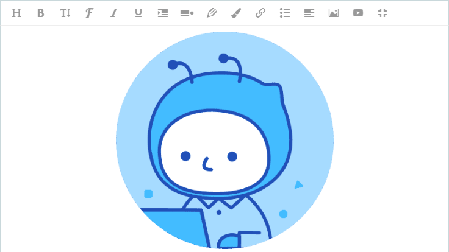

# 「富文本编辑器」图片拖拽缩放

#### 需求：

根据业务要求，需要能够上传图片，且上传的图片能**在移动端中占满屏幕宽度**，故需要能等比缩放上传的图片，还需要能**拖拽**、**缩放**、**改变图片大小**。尝试多个第三方富文本编辑器，很难找到一个完美符合自己要求的编辑器。经过多次尝试，最终选择了[**wangEditor 富文本编辑器**](http://www.wangeditor.com/)。
最初使用的是[**vue2Editor 富文本编辑器**](https://www.vue2editor.com/)，**vue2Editor**本身是不支持图片拖拽的，但是提供了可配置图片拖拽的方法，需要借助**Quill.js**来实现图片拖拽。虽然满足了业务需求，但是在移动端展示的效果不是很理想。
此次编辑器主要是上传的富文本需要在移动端进行展示，为了达到理想效果，需要能修改图片百分比，当设置**img 标签**的 **width 属性**为 **100%** 时，就可以满足需求。最近发新版本（第四版 v4）的 wangEditor 可以满足需求，最终选择了它用于实际开发中。

#### 效果图：



#### 代码案例及相关配置如下：

-   安装插件

```bash title="安装插件"
npm i wangeditor --save
// or
yarn add wangeditor
```

-   编辑器配置

```javascript title="示例代码"
<template>
	<div class="w_editor">
		<!-- 富文本编辑器 -->
		<div id="w_view"></div>
	</div>
</template>

<script>
// 引入富文本
import WE from "wangeditor";
// 引入elementUI Message模块（用于提示信息）
import { Message } from "element-ui";

export default {
	name: "WEditor",
	props: {
		// 默认值
		defaultText: { type: String, default: "" },
		// 富文本更新的值
		richText: { type: String, default: "" }
	},
	data() {
		return {
			// 编辑器实例
			editor: null,
			// 富文本菜单选项配置
			menuItem: [
				"head",
				"bold",
				"fontSize",
				"fontName",
				"italic",
				"underline",
				"indent",
				"lineHeight",
				"foreColor",
				"backColor",
				"link",
				"list",
				"justify",
				"image",
				"video"
			]
		};
	},
	watch: {
		// 监听默认值
		defaultText(nv, ov) {
			if (nv != "") {
				this.editor.txt.html(nv);
				this.$emit("update:rich-text", nv);
			}
		}
	},
	mounted() {
		this.initEditor();
	},
	methods: {
		// 初始化编辑器
		initEditor() {
			// 获取编辑器dom节点
			const editor = new WE("#w_view");
			// 配置编辑器
			editor.config.showLinkImg = false; /* 隐藏插入网络图片的功能 */
			editor.config.onchangeTimeout = 400; /* 配置触发 onchange 的时间频率，默认为 200ms */
			editor.config.uploadImgMaxLength = 1; /* 限制一次最多能传几张图片 */
			// editor.config.showFullScreen = false; /* 配置全屏功能按钮是否展示 */
			editor.config.menus = [...this.menuItem]; /* 自定义系统菜单 */
			// editor.config.uploadImgMaxSize = 5 * 1024 * 1024 /* 限制图片大小 */;
			editor.config.customAlert = err => {
				Message.error(err);
			};
			// 监控变化，同步更新数据
			editor.config.onchange = newHtml => {
				// 异步更新组件富文本值的变化
				this.$emit("update:rich-text", newHtml);
			};
			// 自定义上传图片
			editor.config.customUploadImg = (resultFiles, insertImgFn) => {
				/**
				 * resultFiles：图片上传文件流
				 * insertImgFn：插入图片到富文本
				 * 返回结果为生成的图片URL地址
				 *  */
				// 此方法为自己封赚改写的阿里云图片OSS直传插件。
				this.$oss(resultFiles[0], resultFiles[0]["name"]).then(url => {
					!!url && insertImgFn(url); /* oss图片上传，将图片插入到编辑器中 */
				});
			};
			// 创建编辑器
			editor.create();
			this.editor = editor;
		}
	},
	beforeDestroy() {
		// 销毁编辑器
		this.editor.destroy();
		this.editor = null;
	}
};
</script>
```

**注：** 具体参数配置请参考[**编辑器文档使用说明**](http://www.wangeditor.com/doc/)。

#### 组件中使用抽离的编辑器：

```javascript title="示例代码"
<template>
	<div class="editor">
		<el-card shadow="never">
			<div slot="header" class="clearfix">
				<span>富文本编辑器</span>
			</div>
			<div class="card_center">
				<WEditor :defaultText="defaultText" :richText.sync="richText" />
			</div>
		</el-card>
	</div>
</template>

<script>
// 引入封装好的编辑器
import WEditor from "@/components/WEditor";

export default {
	name: "Editor",
	components: { WEditor },
	data() {
		return {
			// 默认值
			defaultText: "",
			// 富文本更新的值
			richText: ""
		};
	},
	created() {
		// 等待组件加载完毕赋值
		this.$nextTick(() => {
			this.defaultText = `<p style="text-align: center; "></p>`;
		});
	}
};
</script>
```
