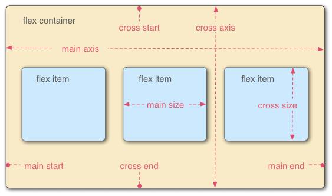
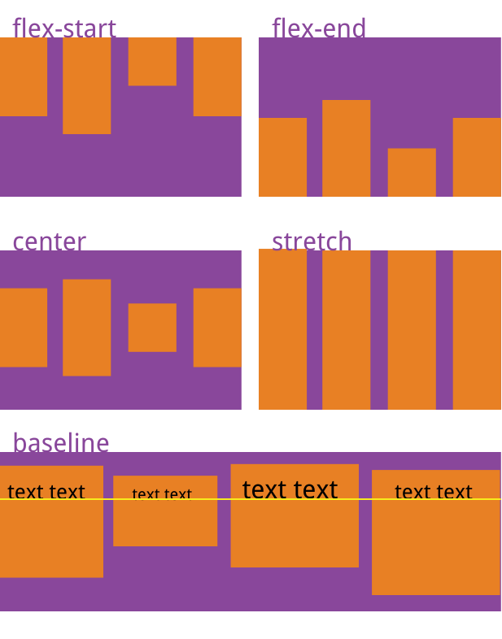
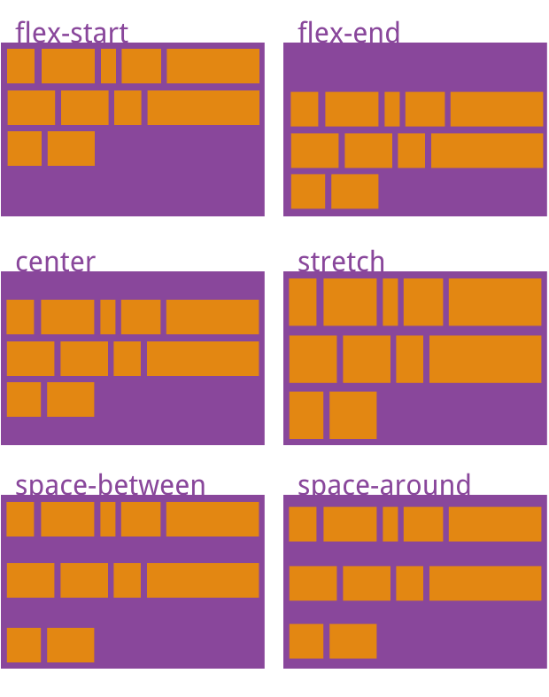

# Flex 弹性布局

### Flex 弹性盒子布局

-   任何一个容器都可以指定 **Flex** 布局

```css title="CSS 样式"
.box {
	/* 兼容Safari */
	display: -webkit-flex;
	display: flex;
}
```

注：**Webkit** 内核的浏览器，必须加上 **-webkit-** 前缀。

-   行内元素也可以使用**Flex**布局

```css title="CSS 样式"
.box {
	display: inline-flex;
}
```

:::warning 注意：
&emsp;&emsp;父元素设为**Flex 布局**后，子元素的 **float**、**clear** 和 **vertical-align** 属性将不起作用。

&emsp;&emsp;容器默认两根轴：**主轴**【横轴】(main axis)  和  **交叉轴**【纵轴】(**cross axis**)，项目默认沿主轴排列。
:::



### 容器（flex container）属性

#### 1、flex-direction

-   属性：决定主轴的方向（即项目的排列方式）
-   **row**（默认值）：主轴方向为水平方向，起点在左端。
-   **row-reverse**：主轴方向为水平方向，起点在右端。
-   **column**：主轴方向为垂直方向，起点在顶端。
-   **column-reverse**：主轴方向为垂直方向，起点在底端。

```css title="CSS 代码"
.box {
	/* 1、默认：→ 向右 */
	flex-direction: row;
}

.box {
	/* 2、← 向左 */
	flex-direction: row-reverse;
}

.box {
	/* 3、↓ 向下，起点在上 */
	flex-direction: column;
}

.box {
	/* 4、向上，起点在下 */
	flex-direction: column-reverse;
}
```

**示意图：**


#### 2、flex-wrap

-   属性：决定在同一轴线上排列的项目是否换行

**示意图：**


**属性值：**

-   **nowrap**（默认）：不换行。
-   
-   **wrap**：换行，第一行在上方。
-   
-   **wrap-reverse**：换行，第一行在下方。
-   

```css title="CSS 代码"
.box {
	/* 1、不换行（默认） */
	flex-wrap: nowrap;
}

.box {
	/* 2、换行 */
	flex-wrap: wrap;
}

.box {
	/* 3、换行，第一行在下 */
	flex-wrap: wrap-reverse;
}
```

#### 3、flex-flow

-   属性：flex-direction 和 flex-wrap 的简写形式，默认值：row nowrap

```css title="CSS 代码"
.box {
	flex-flow: row nowrap;
	flex-flow: row wrap;
	flex-flow: row wrap-reverse;
}

.box {
	flex-flow: row-reverse nowrap;
	flex-flow: row-reverse wrap;
	flex-flow: row-reverse wrap-reverse;
}

.box {
	flex-flow: column nowrap;
	flex-flow: column wrap;
	flex-flow: column wrap-reverse;
}

.box {
	flex-flow: column-reverse nowrap;
	flex-flow: column-reverse wrap;
	flex-flow: column-reverse wrap-reverse;
}
```

#### 4、justify-content

-   属性：定义项目在主轴上的对齐方式

属性值：

-   **flex-start**（默认值）：左对齐。
-   **flex-end**：右对齐。
-   **center**：居中。
-   **space-between**：两端对齐，项目之间的间隔都相等。
-   **space-around**：每个项目两侧的间隔相等，所以项目之间的间隔比项目与边框的间隔大一倍。

```css title="CSS 代码"
.box {
	justify-content: flex-start;
}

.box {
	justify-content: flex-end;
}

.box {
	justify-content: center;
}

.box {
	justify-content: space-between;
}

.box {
	justify-content: space-around;
}
```

**示意图：**


#### 5、align-items

-   属性：定义项目在交叉轴上的对齐方式

属性值：

-   **flex-start**：交叉轴起点对齐。
-   **flex-end**：交叉轴终点对齐。
-   **center**：交叉轴中点对齐。
-   **baseline**：项目的第一行文字的基线对齐。
-   **stretch**（默认值）：若项目未设置高度或设置为 **auto** 将占满这个容器的高度。

```css title="CSS 代码"
.box {
	align-items: flex-start;
}

.box {
	align-items: flex-end;
}

.box {
	align-items: center;
}

.box {
	align-items: baseline;
}

.box {
	align-items: stretch;
}
```

**示意图：**


#### 6、align-content

-   属性：定义多根轴线的对齐方式，若只有一根轴线，则该属性不起作用

属性值：

-   **flex-start**：与交叉轴起点对齐。
-   **flex-end**：与交叉轴终点对齐。
-   **center**：与交叉轴中点对齐。
-   **space-between**：与交叉轴两端对齐，轴线之间的间隔平均分布。
-   **space-around**：每根轴线两侧的间隔都相等，所以轴线之间的间隔比轴线与边框的间隔大一倍。
-   **stretch**（默认值）：轴线占满整个交叉轴。

```css title="CSS 代码"
.box {
	align-content: flex-start | flex-end | center | space-between | space-around | stretch;
}
```

**示意图：**

